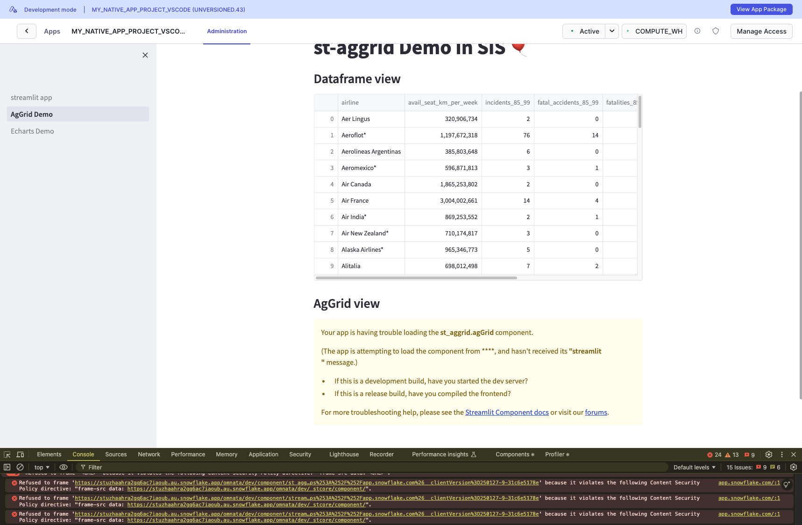

## Repro for bidirectional custom components not working in a native app

This example is borrowed from here:
https://github.com/Snowflake-Labs/snowflake-demo-streamlit/tree/main/PREVIEW%3A%20Bidirectional%20Custom%20Components


Steps:

1. Ensure snowcli is installed
2. `cd` into `my_app/app`
3. deploy the native app, e.g.:
```
snow app run --connection dev
```
4. Try to launch the native app

Result: 

The issue is that the streamlit URL starts like this:
```
https://stuzhaahra2gq6ac7iaoub.au.snowflake.app/omnata/dev/component/st_aggrid.agGrid/index.html......
```

but the custom component iframe security policy requires:

```
https://stuzhaahra2gq6ac7iaoub.au.snowflake.app/omnata/dev/_stcore/component/
```

### Dev container

There is a dev container definition available for vscode users, but it mounts your local snowcli config and .ssh folder, so a little bit more effort and probably not worth it given how simple the app build/deploy is.